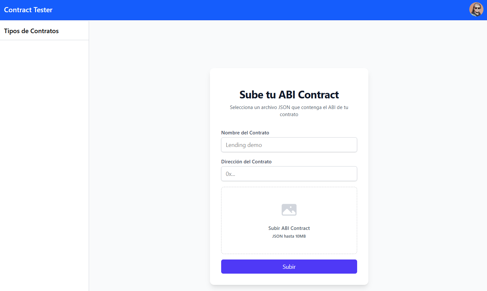
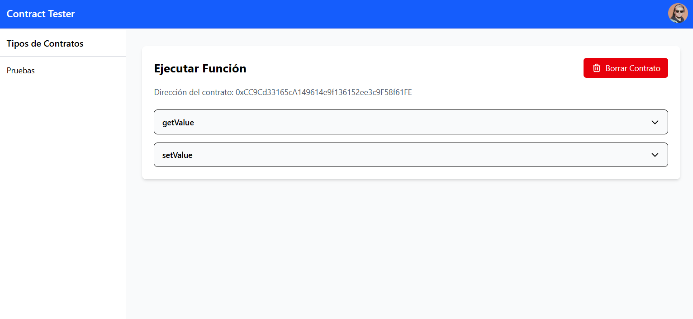

# React Contract Tester Local

Una aplicación web para probar contratos inteligentes de Ethereum localmente utilizando React, TypeScript y Web3.js.

## Descripción

Esta aplicación permite a los desarrolladores interactuar con contratos inteligentes de Ethereum en un entorno local. Proporciona una interfaz de usuario intuitiva para desplegar, probar y depurar contratos inteligentes sin necesidad de conectarse a la red principal de Ethereum.

## Características

- Interfaz de usuario moderna construida con React y TailwindCSS
- Integración con Web3.js para interactuar con la blockchain
- Gestión de estado con Zustand
- Formularios manejados con React Hook Form
- Desarrollo con TypeScript para mayor seguridad de tipos

## Screenshots

Vista de carga de contratos



Vista detalle de contrato



## Requisitos previos

- Node.js (versión 18 o superior)
- npm o yarn
- MetaMask o cualquier wallet compatible con Web3

## Instalación

1. Clona este repositorio:

   ```bash
   git clone https://github.com/tu-usuario/react_contract_tester_local.git
   cd react_contract_tester_local
   ```

2. Instala las dependencias:
   ```bash
   npm install
   # o
   yarn install
   ```

## Uso

### Desarrollo

Para iniciar el servidor de desarrollo:

```bash
npm run dev
# o
yarn dev
```

La aplicación estará disponible en `http://localhost:5173`.

### Construcción para producción

Para construir la aplicación para producción:

```bash
npm run build
# o
yarn build
```

### Vista previa de producción

Para previsualizar la versión de producción:

```bash
npm run preview
# o
yarn preview
```

### Linting y formateo

Para ejecutar el linter:

```bash
npm run lint
# o
yarn lint
```

Para formatear el código:

```bash
npm run format
# o
yarn format
```

## Estructura del proyecto

```
react_contract_tester_local/
├── public/             # Archivos estáticos
├── src/                # Código fuente
│   ├── app/            # Componentes principales de la aplicación
│   ├── components/     # Componentes reutilizables
│   ├── store/          # Estado global con Zustand
│   ├── types/          # Definiciones de tipos TypeScript
│   ├── index.css       # Estilos globales
│   └── main.tsx        # Punto de entrada
├── .gitignore          # Archivos ignorados por Git
├── eslint.config.js    # Configuración de ESLint
├── index.html          # Plantilla HTML
├── package.json        # Dependencias y scripts
├── tsconfig.json       # Configuración de TypeScript
└── vite.config.ts      # Configuración de Vite
```

## Tecnologías utilizadas

- [React](https://reactjs.org/) - Biblioteca para construir interfaces de usuario
- [TypeScript](https://www.typescriptlang.org/) - Superset tipado de JavaScript
- [Vite](https://vitejs.dev/) - Herramienta de construcción y desarrollo
- [TailwindCSS](https://tailwindcss.com/) - Framework CSS utilitario
- [Web3.js](https://web3js.readthedocs.io/) - Biblioteca para interactuar con Ethereum
- [Zustand](https://github.com/pmndrs/zustand) - Gestión de estado
- [React Hook Form](https://react-hook-form.com/) - Manejo de formularios

## Licencia

[MIT](LICENSE)
